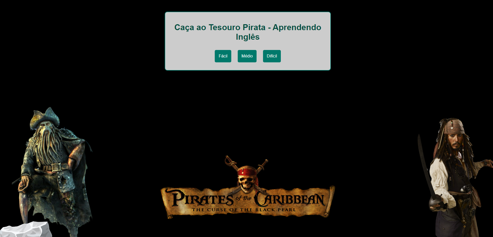

# Pirates of the Caribbean Game ☠️🏴‍☠️🦜
Jogo estilo quizz em inglês, utilizando os conteúdos CAN, COULD & BE ABLE TO. Feito com HTML, CSS e JavaScript.

> Este quizz conta com perguntas e imagens ilustrativas, além de dicas para facilitar o game. Foi feito para auxiliar na evolução do vocabulário e na gramática do inglês.  

## 🏝️☠️ Piratas do Caribe

Piratas do Caribe é uma popular franquia de filmes de aventura e fantasia produzida pela Disney, que gira em torno das aventuras do excêntrico e carismático capitão Jack Sparrow, interpretado por Johnny Depp.
A série mistura elementos de ação, humor e mitologia pirata, ambientada nos mares do Caribe durante a Era Dourada da Pirataria. O primeiro filme, "Piratas do Caribe: A Maldição do Pérola Negra," foi lançado em 2003
e se tornou um grande sucesso, gerando várias sequências. A franquia é conhecida por seus personagens memoráveis, cenas de batalha épicas e trilha sonora icônica composta por Hans Zimmer e Klaus Badelt.  

## 💻🕹️ Personalização e criatividade do game

O jogo conta com um quizz de perguntas e respostas em inglês a respeito da franquia dos filmes Piratas do Caribe, com foco nos conteúdos "CAN", "COULD" & "BE ABLE TO". As imagens com elementos dos filmes, 
a trilha sonora, o tempo para responder e a pontuação por meio de moedas deixam este jogo extremamente envolvente e divertido. 
